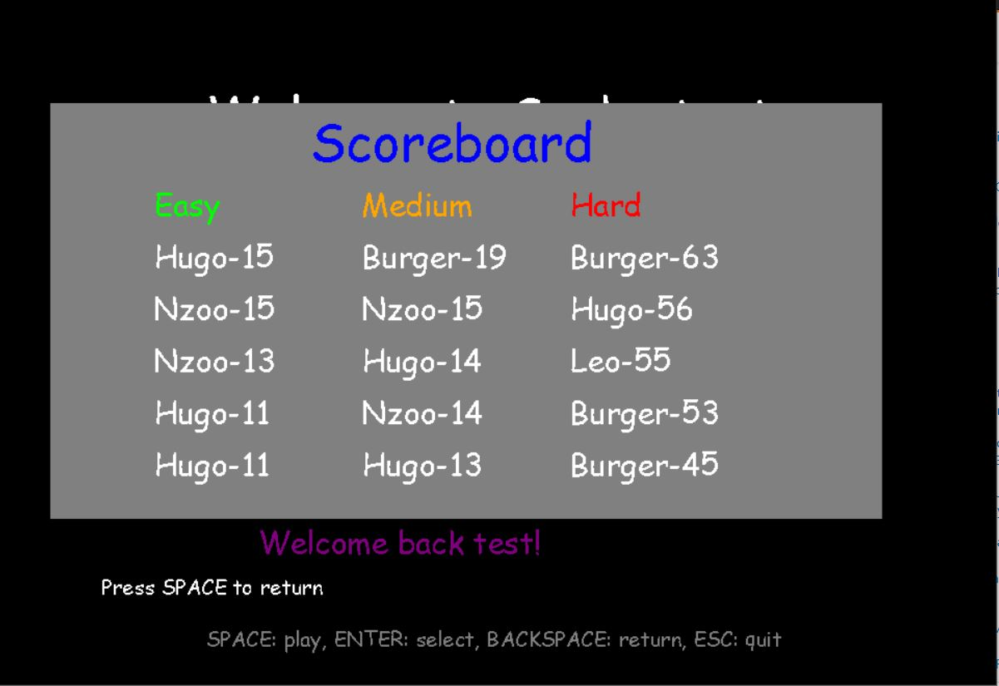

## SNAKE WITH PYTHON

The classic snake game made with python and pygame.

### Description

This is a simple snake game made with python and pygame. The game has 3 difficulty levels, a scoreboard, a game history and a login system.

### Features

- 3 difficulty levels
- Scoreboard
- Game history
- Login system
- Highscore
- Closing window
- New user tutorial
- Hashed passwords
- Login and register validation
- Speed increase with difficulty
- Snake speed increase with score %10
- Unique color gameplay at each game
- Unique color snake at each game
- Unique color apple at each game
- Color changes when score %10

### Help for corrections

- During the game, if you press the ESC key, the game will be paused and you will be able to go to the main menu or exit the game.
- During the development of the game, I encountered a problem with my initial repository. I had to create a new repository and copy the files from the old one. I have not been able to find a solution to this problem. I apologize for the inconvenience.
-To follow my commit history, you can go to the following link:
    -Initial repository: https://github.com/hugo-andriamaromanana/corrupt_snake.git (6 commits)
    -Initial repository branch: https://github.com/hugo-andriamaromanana/corrupt_snake/tree/home_menu (38 commits)
    -New repository: https://github.com/hugo-andriamaromanana/snake 

### How to play

- On each menu, You'll have to press the up or down arrow key to select an option and press enter to validate your choice.
- On sub menus, you'll have to press the left or right arrow key to select an option and press enter to validate your choice.
- On sub windows, (like the scoreboard/history window), you'll have to press the SPACE key to close the window.
- Use the arrow keys to move the snake
- Eat the apples to grow
- Don't hit the walls or yourself

### How to run

- Install python 3.6 or higher
- Install pygame
- Run the game with `python snake.py`

### INSTALLATION

- Clone the repository
```bash
git clone https://github.com/hugo-andriamaromanana/snake.git
```

- Install the dependencies
```bash
pip install pygame
```

- Run the game
```bash
python snake.py
```

### SCREENSHOTS





### CREDITS

- [Hugo Andriamaromanana](https://github.com/hugo-andriamaromanana)
- [Pygame](https://www.pygame.org/news)
- [Pygame documentation](https://www.pygame.org/docs/)

